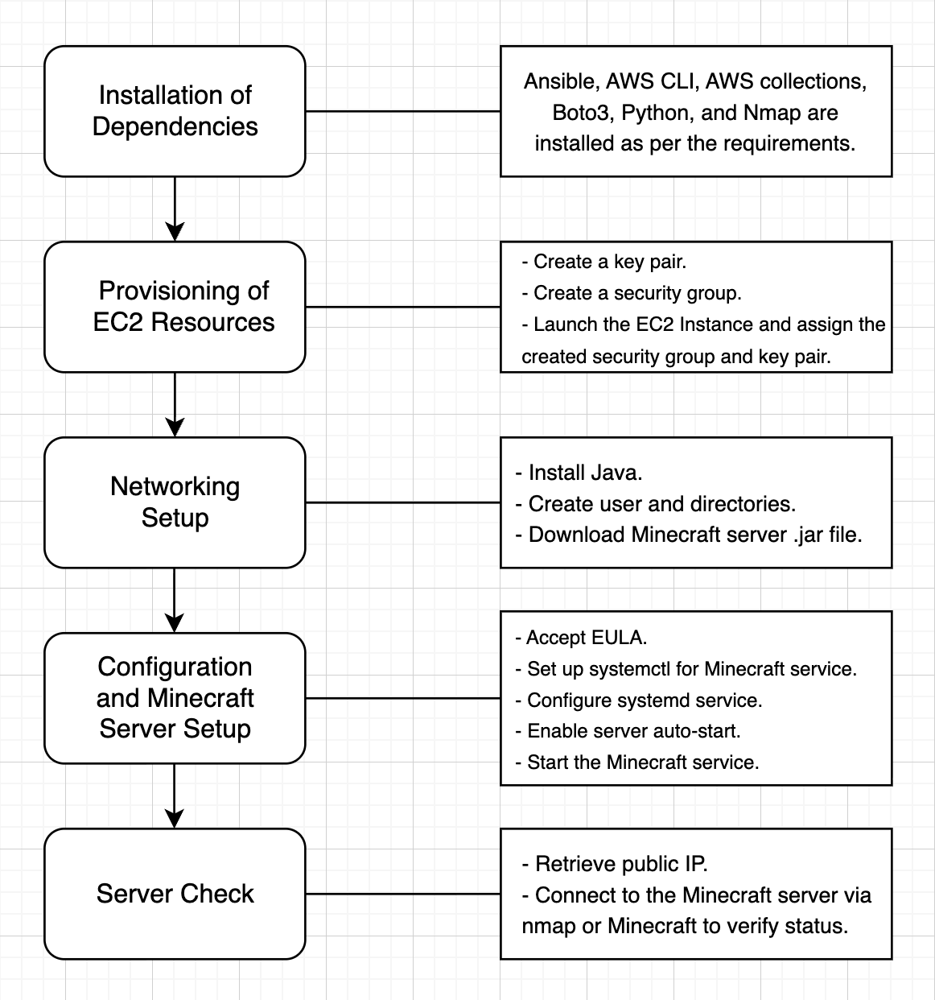

<h1>Minecraft Server Automated Provisioning, Configuration, and Setup Tutorial</h1>

<h2>Background</h2>

1. What will we do?
    
    This tutorial covers the use of Ansible and Bash scripts to automate the setup of AWS resources for a Minecraft server.

2. How will we do it?
    
    The initial installations will be covered by running a Bash script. The automation will be done through Ansible scripts where the provisioning of EC2 resources and network setup will take place. Within the scripts, a configuration for the Minecraft server restart will also be included. That is, the server would be set to restart during the reboot of resources.

<h2>Requirements</h2>

These are required for the completion of this tutorial.

1. AWS account
2. AWS configuration
    - AWS Access Key ID
    - AWS Secret Access Key
    - AWS Session Token
3. Ubuntu/Debian OS
4. Download of given files through GitHub website or git clone
5. Installation of Python, Ansible, AWS CLI, Boto3, Nmap, and AWS collections
6. Installation of Java and Minecraft server within the EC2 instance

Note: While the installation within the given requirements is necessary, a Bash script called <b>installation.sh</b> will also be given to assist with the installation of the requirements. The tutorial covers how these requirements will be used. The installation of Java and the Minecraft server setup are also covered within the tutorial.

<h2>Overview of Different Stages of the Pipeline</h2>

1. Installation of Dependencies
    - Ansible, AWS CLI, AWS collections, Boto3, Python, and Nmap are installed as per the requirements.

2. Provisioning of EC2 Resources
    - Create a key pair.
    - Create a security group.
    - Launch the EC2 Instance and assign the created security group and key pair.

3. Networking Setup
    - Install Java.
    - Create user and directories.
    - Download Minecraft server .jar file.

4. Configuration and Minecraft Server Setup
    - Accept EULA.
    - Set up systemctl for Minecraft service.
    - Configure systemd service.
    - Enable server auto-start.
    - Start the Minecraft service.

5. Server Check
    - Retrieve public IP.
    - Connect to the Minecraft server via nmap or Minecraft to verify status.


<b>Diagram of the Major Steps in the Pipeline</b>


<h2>Tutorial</h2>

Before starting, it must be noted that the tutorial assumes these commands and scripts will be run on an Ubuntu/Debian OS. The files provided must also be downloaded through the GitHub website or by using git clone. This tutorial also assumes that files being referred to are within the same directory.

[https://github.com/pauntea/CS312-Course-Project-P2](https://github.com/pauntea/CS312-Course-Project-P2)

For git clone, run the following command and enter the created directory.

```
git clone https://github.com/pauntea/CS312-Course-Project-P2
```

<h3>Part 1: Dependencies Installation</h3>

1. Install the dependencies using the following commands.

Bash
```
sudo chmod +x installation.sh
sudo ./installation.sh
```

The Bash script commands ensure that the local device checks and downloads the latest available versions of its software. Ansible, AWS CLI, and the AWS collections are also installed for the purpose of automating the provisioning, configuration, and management of AWS resources. Boto3 is installed along with Python3 to meet the requirements of AWS modules with Ansible. Nmap will be used for connecting to the Minecraft server address.


<h3>Part 2: Provisioning EC2 Resources</h3>

1. Create and store AWS credentials on the local device using the given command.

Bash
```
aws configure
```

Enter the appropriate values when asked.

<b>AWS Access Key ID</b>, <b>AWS Secret Access Key</b>, and <b>AWS Session Token</b> can be found on the Learner Lab module under <b>AWS CLI</b> on <b>AWS Details</b>.
Default region name: `us-east-1`
Default output format: `json`

2. Create the key pair to attach to the EC2 instance with the following commands.

Bash
```
aws ec2 create-key-pair --key-name auto-minecraft-key --region us-east-1 --query 'KeyMaterial' --output text > auto-minecraft-key.pem
chmod 400 auto-minecraft-key.pem
```

This creates the key pair to be used within the EC2 instance, which will allow us to connect to it through the private key.

3. Launch the EC2 instance using Ansible by running the following command.

Bash
```
ansible-playbook launch-ec2.yaml
```

This playbook launches the EC2 instance with the appropriate values for a Minecraft server. It also creates a security group that will allow users to connect to the server through port 25565. The instance utilizes this security group as well as the generated key pair created previously.

<h3>Part 3: Networking and Minecraft Server Setup</h3>

1. For the minecraft server setup, run the following command.

Bash
```
ansible-playbook -i inventory.ini server.yaml
```

This playbook installs Java and sets up the Minecraft server. It also ensures that the server will restart when the resources are rebooted.

<h3>Part 4: Checking Server Status</h3>

1. To retrieve the public IP, use the following command.

```
aws ec2 describe-instances --filters "Name=tag:Name,Values=Auto Minecraft Server" --query "Reservations[].Instances[].PublicIpAddress" --output text
```

2. Verify the Minecraft server status by using the given command.

Bash
```
nmap -sV -Pn -p T:25565 <public_ip>
```

Replace the public IP with the value given from the previous command.


*The website below was used as a reference for the Minecraft server and systemctl setup script.*

Link: [https://aws.amazon.com/blogs/gametech/setting-up-a-minecraft-java-server-on-amazon-ec2/](https://aws.amazon.com/blogs/gametech/setting-up-a-minecraft-java-server-on-amazon-ec2/)


<h2>Connecting to Minecraft Server</h2>

1. To retrieve the public IP, use the following command.

```
aws ec2 describe-instances --filters "Name=tag:Name,Values=Auto Minecraft Server" --query "Reservations[].Instances[].PublicIpAddress" --output text
```

2. On the Minecraft main menu, select **“Multiplayer”**. 
    - Select **“Proceed”** to continue. 

3. Add the Minecraft server.
    - Click on **“Add Server”**. 
    - Add the server name and address. 
        - **Name**: `“Auto server”`
        - Use the **public IP address** given by the previous command for the **server address**. 
    - Add the server by clicking on **“Done”**. 

3. Connect to the server by clicking on the server and clicking **“Join Server”**. 


*This tutorial was made with the guide of the following resources and AI. The references were used for research and learning purposes. OpenAI was used for debugging and learning purposes. All credits go to the rightful owners.*

<h1>References</h1>

Ganger, M., & Grode, C. (2023, December 7). Setting up a Minecraft Java server on Amazon EC2. [https://aws.amazon.com/blogs/gametech/setting-up-a-minecraft-java-server-on-amazon-ec2/](https://aws.amazon.com/blogs/gametech/setting-up-a-minecraft-java-server-on-amazon-ec2/)

Kumarasiri, D. (2025, March 9). Automating AWS EC2 Instance Provisioning with Ansible. [https://medium.com/@dhanikaa/automating-aws-ec2-instance-provisioning-with-ansible-18f57d863fee](https://medium.com/@dhanikaa/automating-aws-ec2-instance-provisioning-with-ansible-18f57d863fee)

Madapparambath, G. (2021, November 2). How to provision AWS infrastructure with Ansible. [https://www.redhat.com/en/blog/ansible-provisioning-aws-cloud](https://www.redhat.com/en/blog/ansible-provisioning-aws-cloud)

OpenAI. (2026). ChatGPT (May 2026 version) [Large language model]. [https://chat.openai.com/](https://chat.openai.com/)